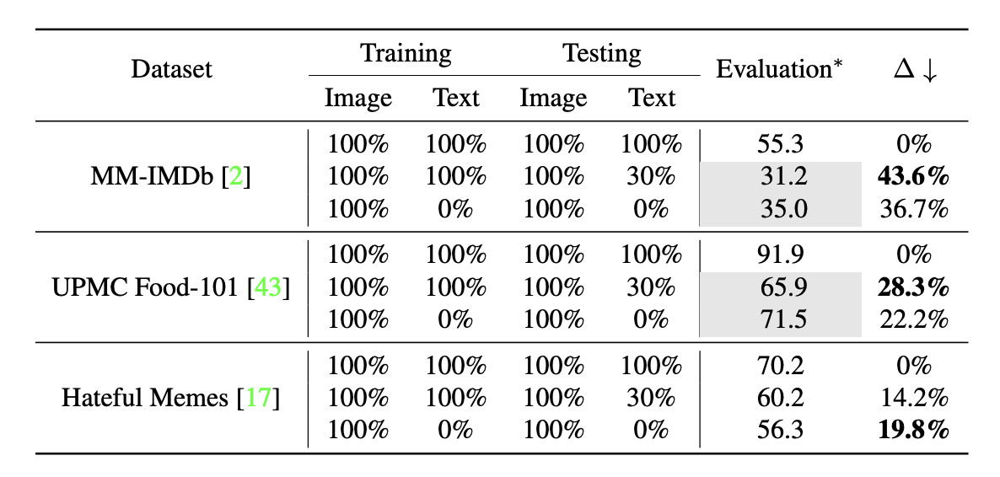
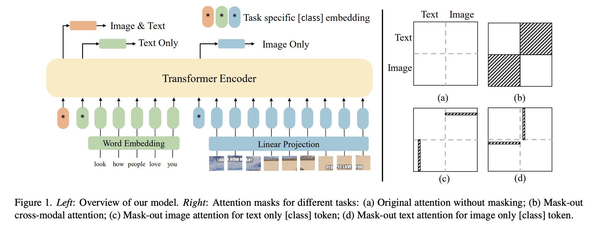

# are multimodal transformers robust to missing modality?

表格展示了多模态训练后测评用部份缺失模态的数据测评带来的性能损失要远高于用单模态训练后单模态测评的结果。

本文观察到不同的模态混合策略（early、lately）会导致该场景下的结果变动较大，且变动因数据而异，没有最优解。本文因此提出了一种自动优化混合方式策略的算法。

## Multi-task Learning

三个分类头分别做：

- full-modal (image + text) task
- image-only task
- text-only task

## Search for the Optimal Fusion Strategy

- [ ] 没看懂怎么搜的

## Dataset

- Hateful Memes
- MM-IMDb
- UPMC Food-101
