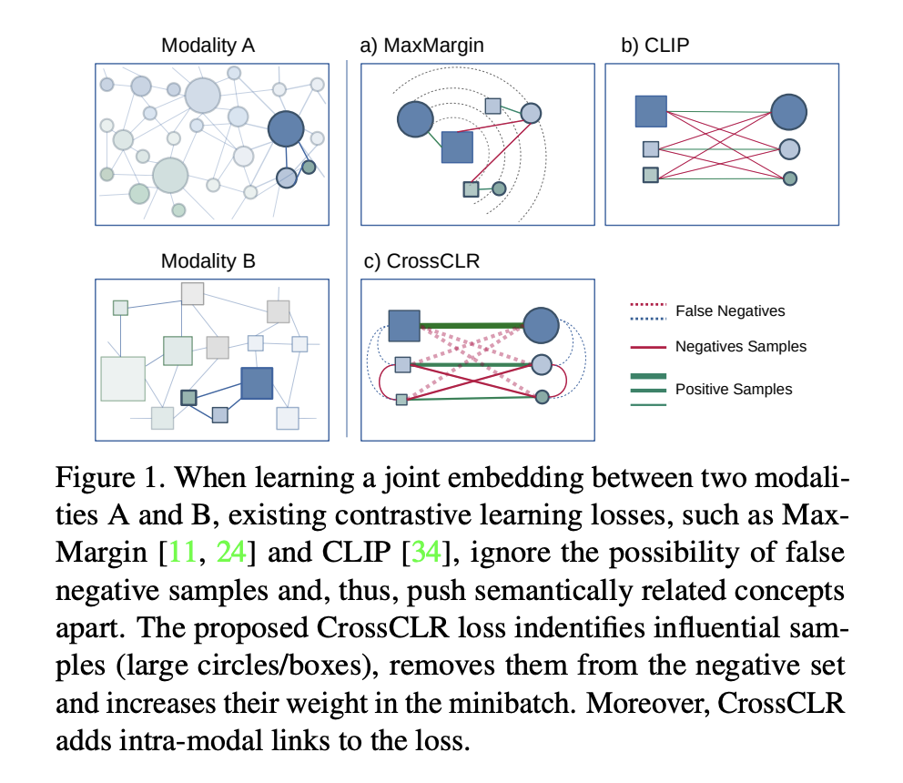
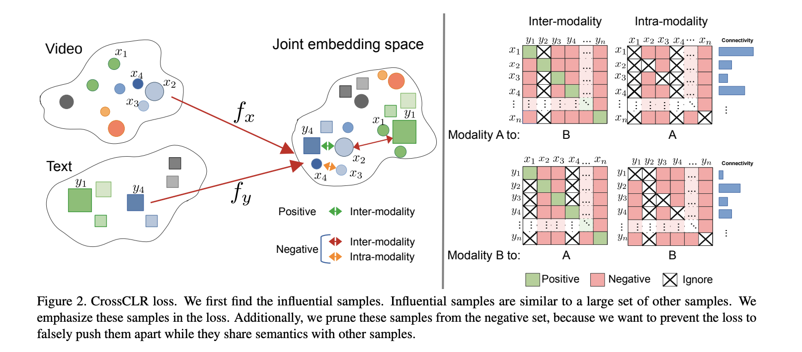
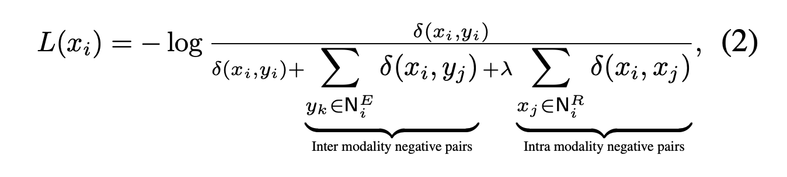
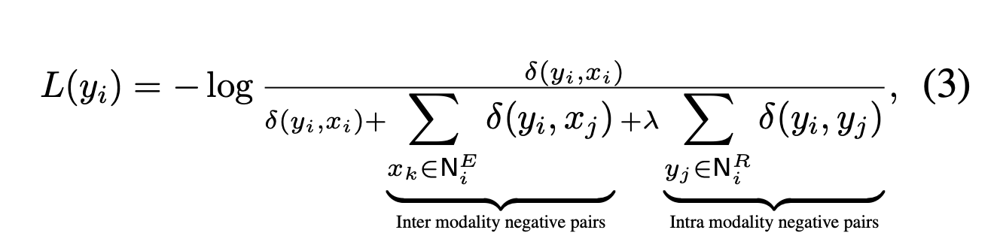
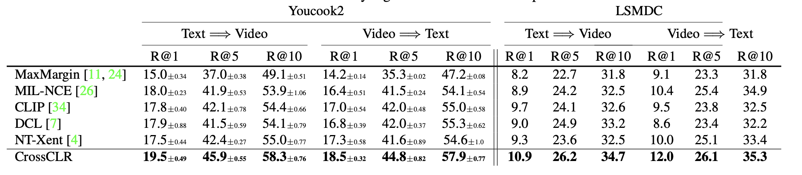
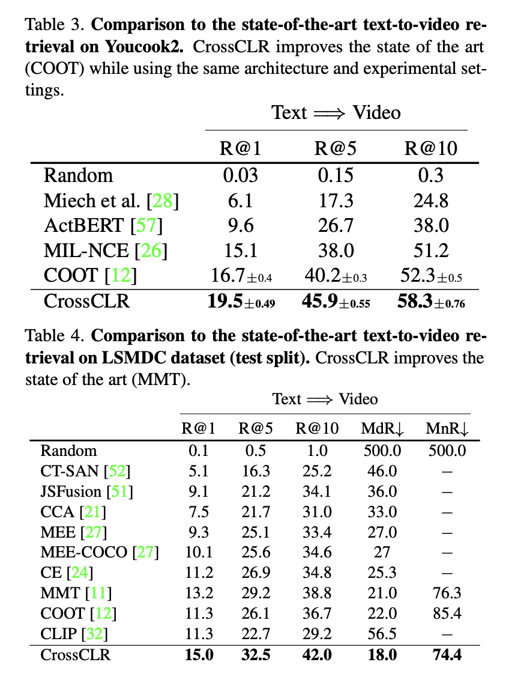

# crossclr: cross-modal contrastive learning for multi-modal video representations

本文提供一种新的对比学习中的正例思路。过去的多模态对比学习过程没有考虑模态内的相似度。

## 如何寻找模态内的相似样本

一共两个对比损失，每个对比损失的负例有两个部分，分别是 `inter-modality` and `intra-modality`

## Dataset

- LSMDC
- Youcook2

## Results

