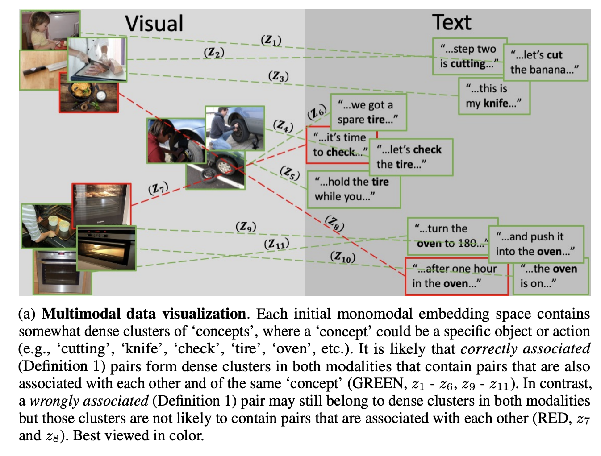

# noise estimation using density estimation for self-supervised multimodal learning

将噪音估计问题转换为多模态空间的密度估计问题。

- 噪音从何而来：收集或标注数据的过程中自带，即使是字幕也可能会出现不一致的现象。比如 HowTo00M 中，作者从随机抽样的 400 个视频中发现有一半是存在这种噪音的。本文作者认为这种噪音可以通过不同模态之间的相关性来缓解。

## Dataset

- HowTo100M
- MSRVTT
- LSMDC
- MSVD
