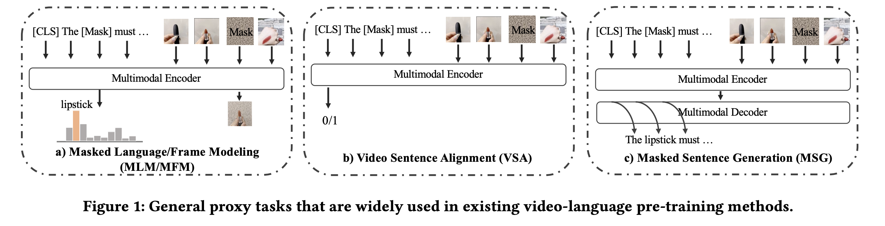
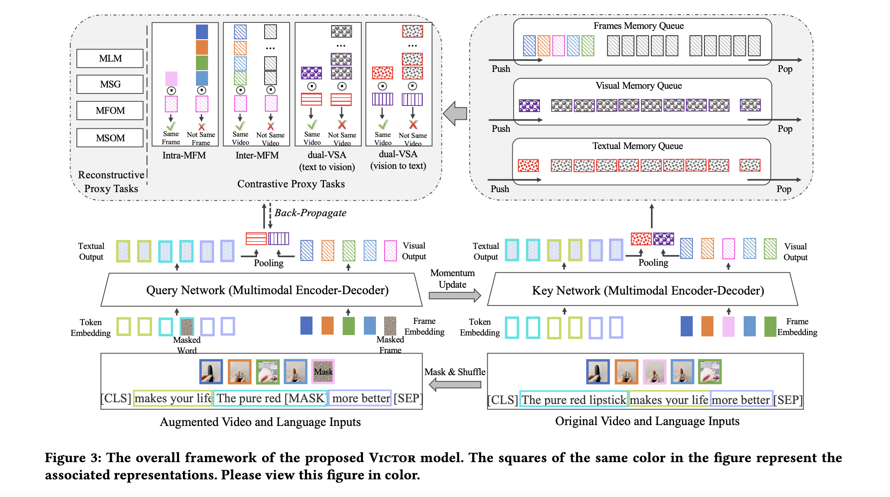
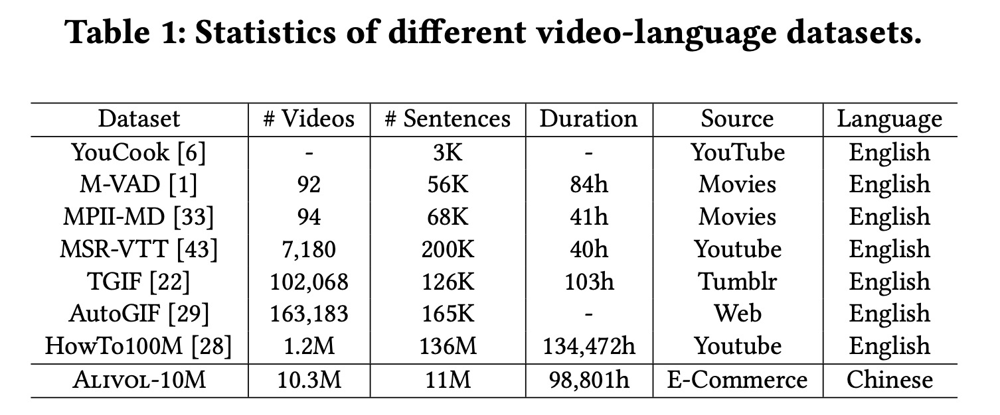

# understanding chinese video and language via contrastive multimodal pre-training

现有的方法：

- 主要聚焦在文本和视频帧的共现上，忽略了其他的结构化信息（序列顺序、时空关系等）
- 视频-文本的对齐和其他的 proxy tasks 存在冲突
- 缺少大规模高质量中文视频语言数据集

本文：

- 在对比学习的范式下构建了多种 Proxy task 来**补充**原来的 Proxy tasks（如 MLM）
- 提供了一个大规模中文数据集

本文分别维护一个有梯度的 Query Network 和没有梯度的 Key Network，每个 batch 同时过两个网络，每个网络中保留的输出包括 sentence 和 video 的每个 timestamp 的特征以及各自模态的 pool 后的特征。其中 Key Network 出来的 video frame feature 和 pool 后的 text feature 、video feature 分别 push 到`Frames Memory Queue`, `Visual Memory Queue`, `Textual Memory Queue` 中，用于对比学习环节。

## Reconstructive Proxy Tasks

- MLM：随机 15% mask 词
- Masked Sentence Order Modeling (MSOF)：将 mask 过后的句子切三份然后随机排列，额外提供一个 k 分类任务，k=3!，即预测是哪一种排列方式。

## Contrastive Proxy Tasks

看图比看公式快多了，这篇论文的模块部份可读性有些差

- Intra-Masked Frame Modeling (intra-MFM)：用于视频模态，每个输出特征和相同时间步的输入特征为正例，不同时间步的输入特征为负例。
- Inter-Masked Frame Modeling (inter-MFM)：每个输出特征和 Frame Memory Query 中相同时间步的输出特征为正例，不同时间步的输出特征为负例。（一般的对比损失）
- Dual Video and Sentence Alignment (dual-VSA)：
  - t2v：pool 后的视频和 Query 池中文本特征为正例，和 Query 池中其他文本特征为负例。
  - v2t：pool 后的文本和 Query 池中视频特征为正例，和 Query 池中其他视频特征为负例。

## Dataset

